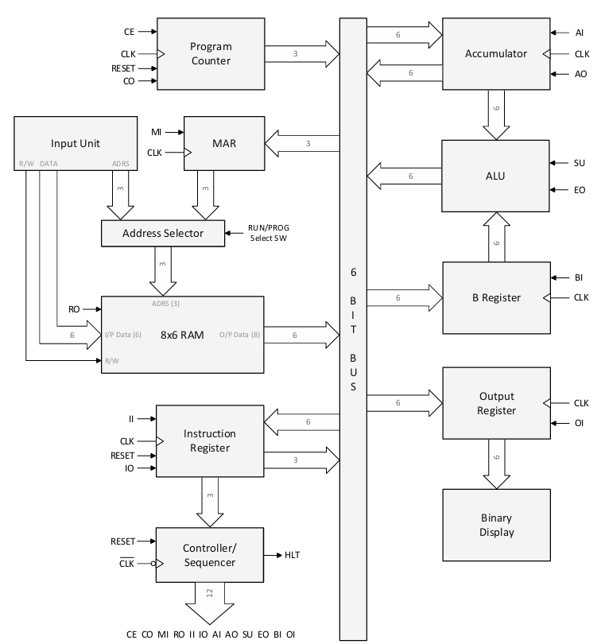
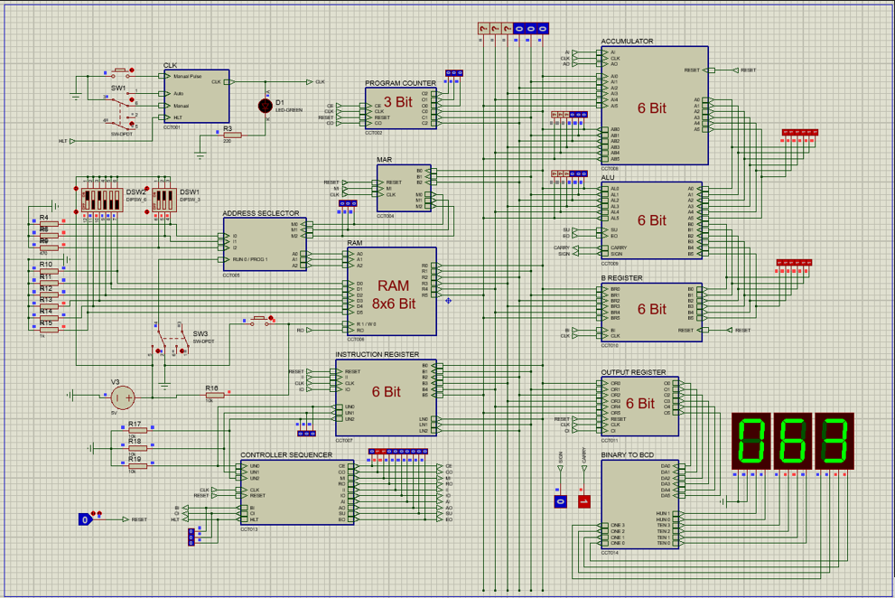
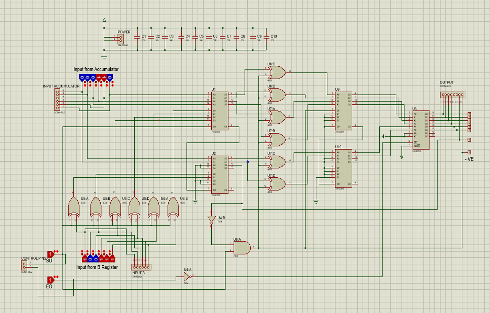
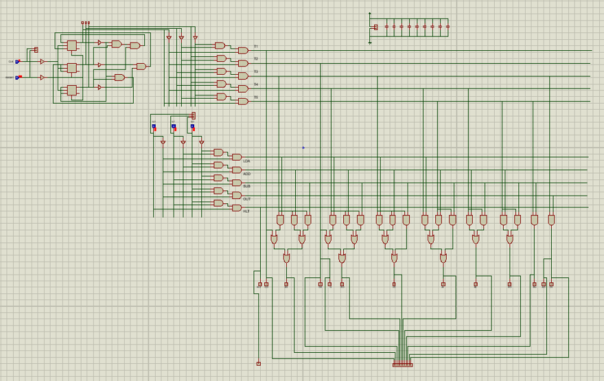
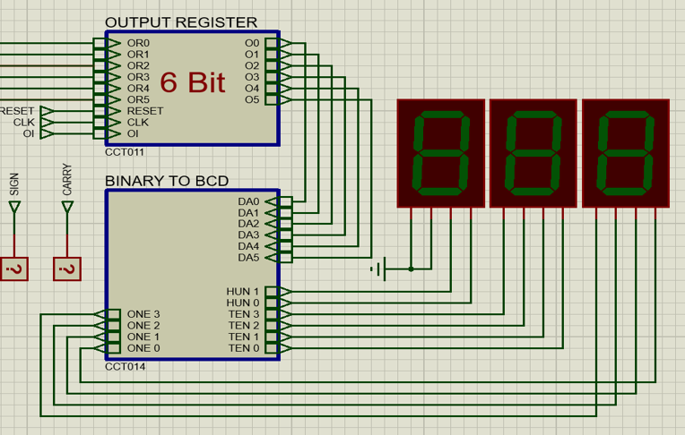

# 6-bit SAP-1 Computer Design using Proteus — EEE 4308

Design and simulation of a **6-bit SAP-1 (Simple-As-Possible) computer architecture** using digital logic circuits in **Proteus Design Suite**.

The project implements the fundamental building blocks of a basic stored-program computer, including a common data bus, program counter, memory system, registers, arithmetic unit, instruction register, controller-sequencer, clock circuitry, and output unit.

The final system supports five instructions:

- `LDA` — Load Accumulator
- `ADD` — Addition
- `SUB` — Subtraction
- `OUT` — Output
- `HLT` — Halt

**Course:** EEE 4308 — Digital Electronics Lab  
**Project:** SAP-1 Architecture-based 6-bit Computer Design and Implementation  
**Architecture:** SAP-1  
**Word Length:** 6 bits  
**Simulation:** Proteus Design Suite  
**Project Group:** Digital Electronauts  
**Institution:** Islamic University of Technology (IUT)

---

## Overview

The objective of this semester project was to design and integrate a functional **6-bit computer based on the SAP-1 architecture** using combinational and sequential digital circuits.

Rather than implementing the processor using a microcontroller or HDL, the computer was constructed from individual digital logic modules.

The complete system contains:

- 6-bit common bus
- 3-bit Program Counter
- Input Unit
- Address Selector
- 3-bit Memory Address Register
- 8×6 RAM
- 6-bit Instruction Register
- Controller-Sequencer
- 6-bit Accumulator
- 6-bit B Register
- 6-bit Arithmetic and Logic Unit
- 6-bit Output Register
- Output display
- Automatic and manual clock operation

Each module was developed and tested separately before being integrated into the final SAP-1 computer.

---

# System Architecture

<p align="center">
  
</p>

The architecture is organized around a **single 6-bit common bus**.

Only one module is allowed to place data on the bus at a given time, preventing bus contention. The controller-sequencer generates control signals that determine which component sends or receives data during each timing state.

---

# Complete Proteus Simulation

<p align="center">
  
</p>

The final Proteus project integrates the individual modules into a complete SAP-1 computer.

The editable project is available at:

[`Proteus/Complete_System/Complete 6 Bit SAP.pdsprj`](Proteus/Complete_System/Complete%206%20Bit%20SAP.pdsprj)

---

# Core Architecture

| Module | Specification | Purpose |
|---|---|---|
| Common Bus | 6-bit | Transfers data between modules |
| Program Counter | 3-bit | Stores address of next instruction |
| MAR | 3-bit | Stores memory address |
| RAM | 8 × 6-bit | Stores program instructions and data |
| Accumulator | 6-bit | Main arithmetic register |
| B Register | 6-bit | Secondary ALU operand register |
| ALU | 6-bit | Performs addition and subtraction |
| Instruction Register | 6-bit | Stores current instruction |
| Controller-Sequencer | 12 control lines + HLT | Generates control sequence |
| Output Register | 6-bit | Stores output value |
| Clock | Auto / Manual | Drives instruction execution |

---

# Common 6-bit Bus

The central bus consists of:

```text
6 data lines
```

and is shared between the major SAP-1 modules.

The design follows an important rule:

```text
Only one module may drive the bus at one time.
```

Other module outputs must be disconnected whenever another component is transmitting.

This prevents:

```text
Bus Contention
```

and allows controlled data movement throughout the processor.

---

# Program Counter

The Program Counter is a:

```text
3-bit binary counter
```

capable of counting:

```text
000 → 111
```

which corresponds to the eight memory locations available in the SAP-1 RAM.

Its main control signals are:

| Signal | Function |
|---|---|
| `CE` | Increment Program Counter |
| `CO` | Put Program Counter value on bus |
| `RESET` | Reset PC to `000` |
| `CLK` | Clock input |

The Program Counter determines the address of the next instruction to be fetched.

---

# Memory Address Register

The **Memory Address Register (MAR)** is a 3-bit register that stores the address of the RAM location currently being accessed.

During normal execution:

```text
Program Counter
      ↓
6-bit Bus
      ↓
MAR
      ↓
RAM Address
```

The relevant control signal is:

```text
MI — Memory Address In
```

---

# Input Unit and Address Selector

The SAP-1 computer includes a programming mode that allows instructions and data to be manually loaded into RAM.

The input unit contains:

```text
6 data switches
3 address switches
Read/Write control
```

An address selector determines whether the RAM address comes from:

```text
PROG Mode → Manual address switches

RUN Mode  → Memory Address Register
```

This makes it possible to program the SAP-1 before execution begins.

---

# Memory

The system uses:

```text
8 × 6-bit RAM
```

meaning:

```text
8 memory locations
×
6 bits per location
```

The RAM stores both:

- Instructions
- Data

Its 3-bit address range is:

```text
000 – 111
```

---

# Registers

## Accumulator — Register A

The **Accumulator** is the main 6-bit arithmetic register.

It:

- receives data from the bus;
- stores intermediate arithmetic results;
- supplies one input to the ALU;
- can place its contents back on the bus.

Main control signals:

```text
AI — Accumulator In
AO — Accumulator Out
```

---

## B Register

The B Register stores the second 6-bit operand used by the ALU.

Control signal:

```text
BI — B Register In
```

---

## Output Register

The Output Register stores a value from the accumulator when an `OUT` instruction is executed.

Control signal:

```text
OI — Output Register In
```

The stored result is then sent to the output-display section.

---

# Arithmetic and Logic Unit

<p align="center">
  
</p>

The ALU performs:

```text
6-bit Addition
6-bit Subtraction
```

Subtraction is implemented using the **2's-complement method**.

The ALU receives its operands from:

```text
Accumulator
     +
B Register
```

Main control signals:

| Signal | Function |
|---|---|
| `SU` | Select addition/subtraction |
| `EO` | Enable ALU output onto bus |

The selection logic is:

```text
SU = 0 → Addition
SU = 1 → Subtraction
```

---

# Instruction Register

The Instruction Register stores the current:

```text
6-bit instruction
```

Each instruction follows the format:

```text
XXX XXX
│   │
│   └── Address / Operand Field
│
└────── Opcode
```

Therefore:

```text
Bits 5–3 → Opcode
Bits 2–0 → Address field
```

The lower three bits can be placed on the bus when a memory address is required.

Important control signals:

```text
II — Instruction Register In
IO — Instruction Register Out
```

---

# Instruction Set

The SAP-1 implementation supports five instructions.

| Instruction | Opcode | Operation |
|---|---:|---|
| `LDA` | `000` | Load RAM data into Accumulator |
| `ADD` | `001` | Add RAM data to Accumulator |
| `SUB` | `010` | Subtract RAM data from Accumulator |
| `OUT` | `011` | Transfer Accumulator to Output Register |
| `HLT` | `111` | Stop processor operation |

---

## LDA — Load Accumulator

```text
LDA address
```

loads the contents of a RAM location into the accumulator.

Conceptually:

```text
RAM[address]
     ↓
Accumulator
```

---

## ADD

```text
ADD address
```

performs:

```text
Accumulator ← Accumulator + RAM[address]
```

---

## SUB

```text
SUB address
```

performs:

```text
Accumulator ← Accumulator - RAM[address]
```

using the ALU's subtraction configuration.

---

## OUT

```text
OUT
```

transfers the accumulator value into the Output Register:

```text
Accumulator
     ↓
Output Register
     ↓
Display
```

---

## HLT

```text
HLT
```

causes the Controller-Sequencer to assert the halt signal.

The halt signal stops the main clock and therefore stops processor execution.

---

# Controller-Sequencer

<p align="center">
  
</p>

The Controller-Sequencer coordinates the complete computer.

It produces the following 12 primary control signals:

```text
CE CO MI RO II IO AI AO SU EO BI OI
```

In addition, it generates:

```text
HLT
```

for stopping the clock.

The controller determines which modules interact with the bus and which operations occur during each timing state.

---

# Instruction Cycle

Each SAP-1 instruction uses a maximum sequence of:

```text
6 timing states
```

identified as:

```text
T1 → T2 → T3 → T4 → T5 → T6
```

The instruction cycle is divided into two parts:

```text
T1 – T3 → Fetch Cycle

T4 – T6 → Execution Cycle
```

---

# Fetch Cycle

The first three timing states are the same for every instruction.

| T-State | Control Signals | Operation |
|---|---|---|
| `T1` | `CO MI` | PC address transferred to MAR |
| `T2` | `CE` | Program Counter incremented |
| `T3` | `RO II` | RAM instruction transferred to Instruction Register |

Conceptually:

```text
T1
PC → MAR

T2
PC ← PC + 1

T3
RAM → Instruction Register
```

---

# Execution Cycle

The final three timing states depend on the decoded instruction.

## LDA

| T-State | Control Signals | Operation |
|---|---|---|
| `T4` | `IO MI` | Address field transferred to MAR |
| `T5` | `RO AI` | RAM data transferred to Accumulator |
| `T6` | — | No operation |

---

## ADD

| T-State | Control Signals | Operation |
|---|---|---|
| `T4` | `IO MI` | Address field transferred to MAR |
| `T5` | `RO BI` | RAM data transferred to B Register |
| `T6` | `EO AI` | ALU result loaded into Accumulator |

---

## SUB

| T-State | Control Signals | Operation |
|---|---|---|
| `T4` | `IO MI` | Address field transferred to MAR |
| `T5` | `RO BI` | RAM data transferred to B Register |
| `T6` | `EO AI SU` | Subtraction result loaded into Accumulator |

---

## OUT

| T-State | Control Signals | Operation |
|---|---|---|
| `T4` | `AO OI` | Accumulator transferred to Output Register |
| `T5` | — | No operation |
| `T6` | — | No operation |

---

## HLT

The HLT instruction does not require normal register-transfer operations.

After HLT is decoded:

```text
Controller-Sequencer
        ↓
      HLT = 1
        ↓
Main Clock Stopped
        ↓
Processor Halted
```

---

# Clock System

The SAP-1 architecture requires two clock modes:

```text
Automatic
Manual
```

### Automatic Mode

Clock pulses advance continuously.

### Manual Mode

A push button allows the user to advance the processor manually one clock cycle at a time.

Manual operation is particularly useful for:

- observing register transfers;
- debugging control signals;
- following the fetch cycle;
- following the execution cycle;
- studying SAP-1 micro-operations.

---

# Output Section

<p align="center">
  
</p>

The Output Register captures the accumulator value when the `OUT` instruction is executed and forwards it to the display section.

This allows the result of a SAP-1 program to be observed externally.

---

# Design and Integration Phases

The semester project was developed incrementally across five phases.

| Phase | Main Work |
|---|---|
| **Phase A** | Clock Pulse Generator, Program Counter, Input Unit and MAR |
| **Phase B** | Accumulator, B Register, Output Register and RAM |
| **Phase C** | ALU, bus integration and Output Unit |
| **Phase D** | Instruction Register and Controller-Sequencer |
| **Phase E** | Complete SAP-1 integration |

This phased development made it possible to test individual subsystems before integrating the complete processor.

---

# Individual Module Simulations

The repository preserves the Proteus designs for the individual SAP-1 modules under:

[`Individual_Modules/`](Individual_Modules/)

These include modules such as:

```text
ALU
Accumulator Register
Address Selector
B Register
Clock
Controller-Sequencer
Input Unit
Instruction Register
MAR
Output Register
Program Counter
RAM
```

Testing modules individually simplified debugging before complete system integration.

---

# Project Demonstration

A video demonstration of the SAP-1 computer is available on YouTube:

**[Watch the SAP-1 Project Demonstration](https://youtu.be/2lBFWoUOhlg)**

The demonstration shows the operation of the project and the integrated SAP-1 design.

---

# How to Open the Proteus Project

## 1. Install Proteus

Use a version of **Proteus Design Suite** capable of opening `.pdsprj` project files.

---

## 2. Open the Complete System

Navigate to:

```text
Proteus/Complete_System/
```

and open:

```text
Complete 6 Bit SAP.pdsprj
```

---

## 3. Program the RAM

Before running the processor, use the input section to configure the required:

```text
RAM Address
6-bit Data / Instruction
Read/Write State
```

while the computer is in programming mode.

---

## 4. Switch to RUN Mode

After the program and required data have been loaded into RAM:

```text
PROG → RUN
```

---

## 5. Reset the Processor

Reset the Program Counter and required registers before beginning execution.

---

## 6. Select Clock Mode

Choose either:

```text
AUTO
```

for continuous execution or:

```text
MANUAL
```

for step-by-step operation.

---

## 7. Run the Simulation

Start the Proteus simulation.

The Controller-Sequencer will execute the program according to the six-state instruction cycle.

---

# Development History

Earlier versions of the integrated SAP design are preserved under:

```text
Archive/
├── Initial/
└── Modified/
```

These files document the development and refinement process that led to the final integrated circuit.

They are retained for historical reference; the primary project file is the version under:

```text
Proteus/Complete_System/
```

---

# Documentation

The complete semester project documentation is available under:

[`Docs/`](Docs/)

## Official Project Specification

[`EEE4308_Semester_Project_Specification.pdf`](Docs/EEE4308_Semester_Project_Specification.pdf)

This document defines the required SAP-1 architecture, modules, instruction set, control signals, timing sequence, and project phases.

---

## Phase Reports

- [`Phase_A_Report.pdf`](Docs/Phase_A_Report.pdf)
- [`Phase_B_Report.pdf`](Docs/Phase_B_Report.pdf)
- [`Phase_C_Report.pdf`](Docs/Phase_C_Report.pdf)
- [`Phase_D_Report.pdf`](Docs/Phase_D_Report.pdf)
- [`Phase_E_Report.pdf`](Docs/Phase_E_Report.pdf)

The reports document the progressive development of the individual modules and complete SAP-1 integration.

---

# Repository Structure

```text
6-bit-SAP-1-Computer-Proteus-EEE4308/
│
├── README.md
│
├── Archive/
│   ├── Initial/
│   │   └── Complete 6 Bit SAP.pdsprj
│   │
│   └── Modified/
│       └── Complete 6 Bit SAP.pdsprj
│
├── Docs/
│   ├── EEE4308_Semester_Project_Specification.pdf
│   ├── Phase_A_Report.pdf
│   ├── Phase_B_Report.pdf
│   ├── Phase_C_Report.pdf
│   ├── Phase_D_Report.pdf
│   └── Phase_E_Report.pdf
│
├── Figures/
│   ├── alu.png
│   ├── complete_proteus_simulation.png
│   ├── controller_sequencer.png
│   ├── output_display.png
│   └── sap1_architecture.png
│
├── Individual_Modules/
│   ├── ALU/
│   ├── Accumulator_Register_A/
│   ├── Address_Selector/
│   ├── B_Register/
│   ├── Clock/
│   ├── Controller_Sequencer/
│   ├── Input_unit/
│   ├── Instruction_Register/
│   ├── MAR/
│   ├── Output_Register/
│   ├── Program_Counter/
│   └── ...
│
└── Proteus/
    └── Complete_System/
        └── Complete 6 Bit SAP.pdsprj
```

---

# Key Digital Electronics Concepts

This project applies several core concepts from Digital Electronics:

- Combinational logic
- Sequential logic
- Registers
- Flip-flops
- Binary counters
- Adders and subtractors
- Two's-complement arithmetic
- Tri-state bus interfacing
- RAM addressing
- Multiplexing
- Instruction decoding
- Clock generation
- Timing sequences
- Finite-state control
- Register-transfer operations
- Processor architecture

---

# Key Learning Outcomes

The project provides practical experience in understanding how basic computer architecture emerges from individual digital circuits.

Major learning outcomes include:

- Designing a common data bus
- Preventing bus contention
- Designing register-transfer paths
- Implementing binary memory addressing
- Building arithmetic circuits
- Implementing 2's-complement subtraction
- Understanding instruction encoding
- Designing fetch and execution cycles
- Generating processor control signals
- Coordinating digital modules using clock signals
- Designing a controller-sequencer
- Integrating independently tested modules
- Debugging a complete digital computer architecture

---

# Limitations

The SAP-1 architecture is intentionally simple.

Current limitations include:

- Only 6-bit data words
- Only 8 RAM locations
- 3-bit memory addressing
- Only five supported instructions
- No conditional branch instructions
- No jump instruction
- No stack
- No interrupt support
- No general-purpose register file
- No multiplication or division instructions
- No external I/O architecture beyond the output section
- Limited program size
- Fixed instruction format

These limitations are consistent with the educational purpose of SAP-1: demonstrating fundamental CPU organization with minimum architectural complexity.

---

# Possible Future Improvements

The architecture could be extended by adding:

- Larger RAM
- Wider data bus
- Additional registers
- Jump instructions
- Conditional branching
- Carry and Zero flags
- Register-to-register instructions
- Expanded ALU functionality
- Multiplication and division
- Stack Pointer
- Input instructions
- Additional output interfaces
- Microcode ROM
- Higher-level SAP architectures
- FPGA implementation
- PCB-based physical implementation

These extensions could evolve the design toward a more capable SAP-2/SAP-3-style architecture or a custom educational processor.

---

# Reference

The project follows the educational **SAP-1 (Simple-As-Possible)** computer architecture studied in Digital Electronics and basic computer architecture.

The commercial reference textbook used during the course is **not redistributed in this repository**.

---

# Academic Context

This project was completed for:

**EEE 4308 — Digital Electronics Lab**

Department of Electrical and Electronic Engineering  
Islamic University of Technology (IUT)

The semester project focused on designing a 6-bit computer using fundamental digital-electronics building blocks rather than relying on a prebuilt processor.

---

# Project Group

**Digital Electronauts**

The project was completed as a group semester project through progressive module design, simulation, testing, and final integration.

---

# Repository Maintainer

**Ar-Rafi Ishraq**  
Electrical and Electronic Engineering
